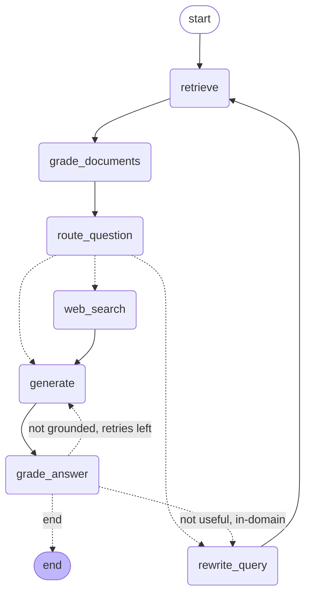

# Agentic RAG over HSBC's Pillar 3 regulatory disclosures

An agentic RAG system over HSBC's public **Pillar 3 Disclosures (31 December 2025)**
that answers capital / leverage / liquidity questions **grounded in the filing** — and,
crucially, returns the *right number*, not just a plausibly-sourced one.

## First run (fresh clone)

The source PDF is included. The vector stores are not (git-ignored, regenerable),
so build them once:

```bash
pip install -r requirements.txt
jupyter nbconvert --to notebook --execute baseline_rag.ipynb   # builds pillar3_baseline
python chunking.py                                             # builds pillar3_structured
```

Then run the demo with `streamlit run app.py`, or score with `python eval.py`.

## The result in one table

Ten labelled questions (`eval_set.json`), each carrying a known trap (row conflation,
wrong date-column, missing unit, cross-reference, required arithmetic). Scored
**deterministically** on three axes — grounded, numerically_correct, complete — by
exact-number matching against gold (no LLM grader is allowed to wave a wrong figure
through). Full harness: `eval.py`; report: [`docs/eval-results.md`](docs/eval-results.md).

| Axis | Baseline | Agentic |
|---|---|---|
| grounded | 6 / 10 | **10 / 10** |
| numerically_correct | 3 / 10 | **10 / 10** |
| complete | 3 / 10 | **10 / 10** |
| **all three (total pass)** | **3 / 10** | **10 / 10** |

### The thesis: "grounded but wrong" is the dangerous failure

Look at the baseline column. Answers were often **grounded (6/10)** yet
**numerically wrong (3/10)**. The system retrieved the *relevant text* and cited the
*right page* — then returned the **wrong figure**: the wrong cell, the wrong date
column, or two rows conflated. For a regulatory assistant, *"plausibly sourced but the
wrong capital number"* is the failure that gets someone in trouble — it looks right and
is confidently cited. **Closing that grounded-vs-correct gap is the whole point of this
project**, and the agentic layer takes it to 10/10.

## How it got there: three stages, 3 → 6 → 10

**Stage 1 — Naive baseline: 3/10** (`baseline_rag.ipynb`, collection `pillar3_baseline`).
Fixed-size 800-char chunking, top-k retrieve, one `gpt-4o-mini` call, no self-check.
The decisive diagnostic: **in every single baseline failure, the correct page was
already in the top-4.** Retrieval and embeddings were *never* the bottleneck — naive
chunking was. Splitting on character count shattered tables, so a number arrived
**stripped of its reporting date, its `$m`/`$bn`/`%` unit, or its row label** (Q10 read
the 30-Sep column instead of 2024; Q6 conflated LCR/NSFR; Q9 returned a stray sub-cell
as the total). Details: [`docs/stress-test-findings.md`](docs/stress-test-findings.md).

**Stage 2 — Structure-aware chunking: 6/10** (`chunking.py`, collection
`pillar3_structured`). Tables are kept whole with their caption, dated column headers,
units row, and row labels bound to every cell; prose is split normally. This fixed
*exactly* the structure-loss failures and nothing else — Q1, Q6, Q10 flipped fail→pass,
Q9's figure+unit corrected, **zero regressions**. What remained was the interesting
part. Using the `retrieved_has_fact` flag, the four residual failures were shown to be
**reasoning problems, not retrieval problems**: the needed fact was provably in-context,
the one-shot model just couldn't use it. That evidence is what *justifies* an agent
rather than more chunking tricks. Details:
[`docs/chunking-impact.md`](docs/chunking-impact.md).

**Stage 3 — Agentic layer: 10/10** (`agentic_rag.ipynb` / `app.py`, LangGraph over
`pillar3_structured`). A grade → route → rewrite/web → generate → self-check loop closes
the four residuals, each a distinct reasoning class:

| | residual failure | how the agent fixes it |
|---|---|---|
| Q4 | operands retrieved, never summed | **compute** in `generate` (`38,490 + 42,380 = 80,870 $m`) |
| Q5 | caveat retrieved, never reasoned | **synthesis** ("same on both transitional & end-point bases") |
| Q8 | right chunk exists but ranks below top-4 | the **regulation-citation guard** fires **self-check → keyword rewrite / multi-hop** to surface the Article-92 chunk |
| Q9 | figure and currency live on different pages | **multi-chunk accumulation** across hops |

Loops are bounded (`MAX_REWRITES=2`, `MAX_RETRIES=2`) and verified never exceeded:
in the saved run, 8 of 10 questions settle in a single pass; only Q4 and Q8 exercise the loop.

## Architecture

A LangGraph `StateGraph` over the structure-aware Chroma collection (loaded, never
rebuilt). `original_question` is kept separate from the working `question` so rewrites
never lose intent; relevant chunks **accumulate across hops**, which is what makes
multi-page synthesis (Q9) and rewrite-then-retrieve (Q8) work.



**Router boundary — in-domain vs needs-web.** Anything about HSBC's *own* disclosed
figures (and the regulatory references the filing itself cites for them, e.g. Article
92(1) of CRR II) is **in-domain**: a missing chunk is a *retrieval* problem to be solved
by rewrite, never a reason to hit the web. The web route is reserved for genuinely
external knowledge (a named peer comparison, "what CRR II requires across banks
generally"). **All 10 in-domain questions stayed in-domain — zero web calls — verified
in the traces** (the `route` column in `docs/eval-results.md` and the live trace in the
Streamlit app).

## Run it

**Setup** (Python 3.13; Camelot needs Ghostscript: `brew install ghostscript`):

```bash
python3 -m venv .venv && source .venv/bin/activate
pip install -r requirements.txt

cp .env.example .env    # then fill in your API keys — .env is git-ignored, never committed
```

Keys live only in `.env` (`OPENAI_API_KEY`, `GOOGLE_API_KEY`, `TAVILY_API_KEY`); they
are never hardcoded and `.env` is in `.gitignore`.

**Reproducible flow** — the two Chroma collections persist in `chroma_db/`
(git-ignored), so build them once, then everything reuses them as-is:

```bash
# 1. Build the BASELINE store (naive chunks)  → collection `pillar3_baseline`
jupyter nbconvert --to notebook --execute baseline_rag.ipynb

# 2. Build the STRUCTURE-AWARE store          → collection `pillar3_structured`
python chunking.py

# 3. Run the AGENT
python build_agentic_nb.py                 # (re)generate the notebook, then execute it
jupyter nbconvert --to notebook --execute agentic_rag.ipynb
#   …or drive it interactively with the live-trace demo:
streamlit run app.py

# 4. Run the EVAL (scores baseline vs agentic → data/eval_results.json + docs/eval-results.md)
python eval.py
```

**Interactive demo (`app.py`).** A thin Streamlit UI over the *same* compiled agent:
ask a question and watch the reasoning trace stream live — `RETRIEVE → GRADE_DOCS →
ROUTE → (REWRITE / WEB) → GENERATE → SELF-CHECK` — so you can see the agent route,
rewrite, compute, and self-verify in real time. Requires the extra dependency
`streamlit` (see `requirements.txt`); run with `streamlit run app.py`.

## Limitations (honest scope)

- **Corpus is pages 4–27** (capital / leverage / liquidity). The reporting-currency
  *definition* lives in front-matter (~PDF p2), outside the extracted range, so **Q9's
  currency is grounded by `$`-notation inference, not retrieval** — flagged as
  `currency_grounding="inference"` in the results, documented not hidden
  (`eval_set.json` carries a `grounding_note`; see the transparency section of
  `docs/eval-results.md`).
- **Q8's regulation-citation guard is a deliberate narrow heuristic** (if the question
  asks "under which regulation/article" and the draft cites none, force a rewrite). It
  targets this failure class; it is not a claim of general robustness.
- **Answer wording varies run-to-run** (live `gpt-4o-mini`); the **scores are
  deterministic and stable** (exact-number matching). A representative run is saved in
  `data/eval_results.json`.
- **Web answers depend on Tavily** result quality/currency, and the answer grader is
  strict — it can over-flag and retry, but always within the bounded retry budget.
- **Deep multi-page tables** (e.g. Table 44 IRB exposures) are **out of v1 scope**; the
  eval targets the headline capital/leverage/liquidity metrics.

## Repo map

| Path | What |
|---|---|
| `data/pillar3-2025.pdf` | Source filing — HSBC's public Pillar 3 Disclosures at 31 Dec 2025 |
| `baseline_rag.ipynb` | Stage 1 — naive baseline (control), builds `pillar3_baseline` |
| `chunking.py` | Stage 2 — structure-aware chunker, builds `pillar3_structured` |
| `build_agentic_nb.py` / `agentic_rag.ipynb` | Stage 3 — the LangGraph agent (regenerable) |
| `app.py` | Streamlit demo with the live reasoning trace |
| `eval.py` | Deterministic eval harness (baseline vs agentic, 3 axes) |
| `eval_set.json` | Canonical 10-question set: question, gold, trap, per-fact PDF-page citations |
| `data/eval_results.json` | Machine-readable per-question results (a representative run) |
| `docs/` | Dated build logs + `eval-results.md` (headline), `chunking-impact.md`, `stress-test-findings.md` |

## Environment variables

| Variable | Purpose |
|---|---|
| `OPENAI_API_KEY` | `gpt-4o-mini` generation + graders |
| `GOOGLE_API_KEY` | `gemini-embedding-001` embeddings |
| `TAVILY_API_KEY` | Tavily web search (external-only routes) |
